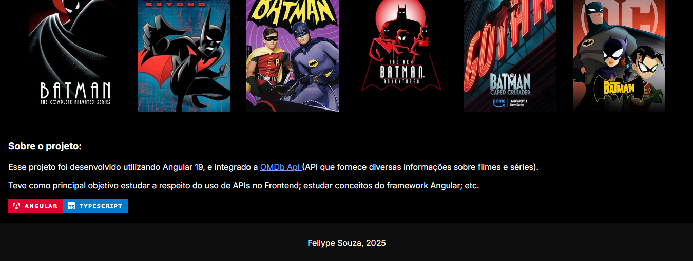

<section>
  <h1>MovieInfo- OMDb API</h1>
  <section class="badges">
    
    
  </section>
  
Site para obter informações de filmes e séries. Foi feito utilizando Angular / <a target="_blank" href="https://www.omdbapi.com/">OMDb API</a>. Acesse <a href="https://fellypesouza.github.io/MovieInfo-OMDb-API/" target="_blank">aqui</a>

  <section class="projectImages">
    <h3>Página Principal:</h3>
    
    
    
    <h3>Página Secundária:</h3>
    
  </section>
</section>
